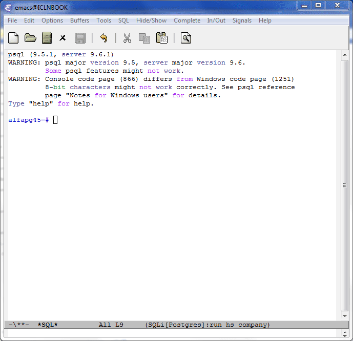

# emacs-sql-mode-tool
emacs-sql-mode-tool is a set of tools for writing sql code using sql-mode (only supported by PostgreSQL).



bin - psql for windows without batch mode

company-sql.el - simple company-mode completion back-end for sql-mode. Autocomplite schema, table, column and function

sql-def.el - open function ddl

## Setup

```lisp
(add-to-list 'load-path "path-to-emacs-sql-mode-tool\\")
(require 'company) 
(require 'company-sql)
(add-to-list 'company-backends 'company-sql)
(autoload 'sql-def-buffer-create-for-name-at-point "sql-def")
```
In sql-mode hook:
```lisp
(local-set-key (kbd "M-.") 'sql-def-buffer-create-for-name-at-point)
```
